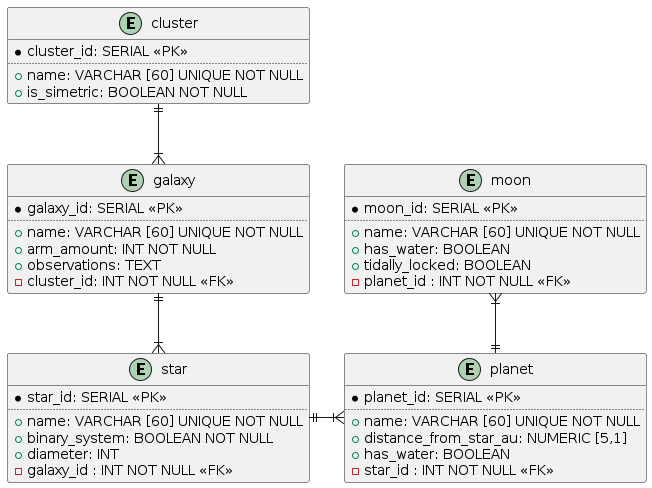

# Universe: Relational Database

This project is part of the FreeCodeCamp Relational Database Certification.

## Description

This project showcases my skills in working with PostgreSQL, a powerful open-source relational database management system. The project demonstrates the implementation of various basic SQL queries and database operations.

## Abilities and Concepts Demonstrated

- Database Creation: Set up a new PostgreSQL database to store data.
- Table Design: Leverage diagraming tool PlantUML to ease the desing of tables before setting them up.
- Data Insertion: Insert data into the database tables using SQL INSERT statements.
- Relationships: Establish relationships between tables using foreing keys.
- Constraints and Validation: Implement various constraints like UNIQUE and NOT NULL for data validation and integrity.

## Achievement

This project allowed me to gain insights into PostgreSQL and practice basic SQL queries and operations.

## DB Diagram

Even though my diagram might not be the most polished, it let me set up the database tables with minimal errors! Reducing the time spent building and correcting it. Taking time to desing before building is certainly essential!
